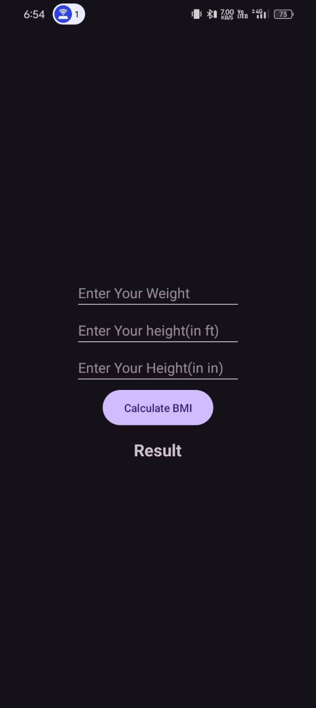

# BMI Application

This is an Android application to calculate Body Mass Index (BMI). The app takes input for weight, height in feet, and height in inches to compute the BMI and display whether the user is underweight, healthy, or overweight.

## Features

- Input fields for weight, height in feet, and height in inches.
- Calculate BMI based on the input values.
- Display the BMI result and a corresponding health message.

## Screenshots

  

## Installation

To install the application, download the APK file from the link below and install it on your Android device.

### Download APK

[Download the APK](apk/app-debug.apk)

## Usage

1. Open the app.
2. Enter your weight in kilograms.
3. Enter your height in feet and inches.
4. Press the "Calculate" button to see your BMI and health status.

## Contributing

If you would like to contribute to the project, feel free to fork the repository and submit a pull request.

## License

This project is licensed under the MIT License - see the [LICENSE](LICENSE) file for details.
